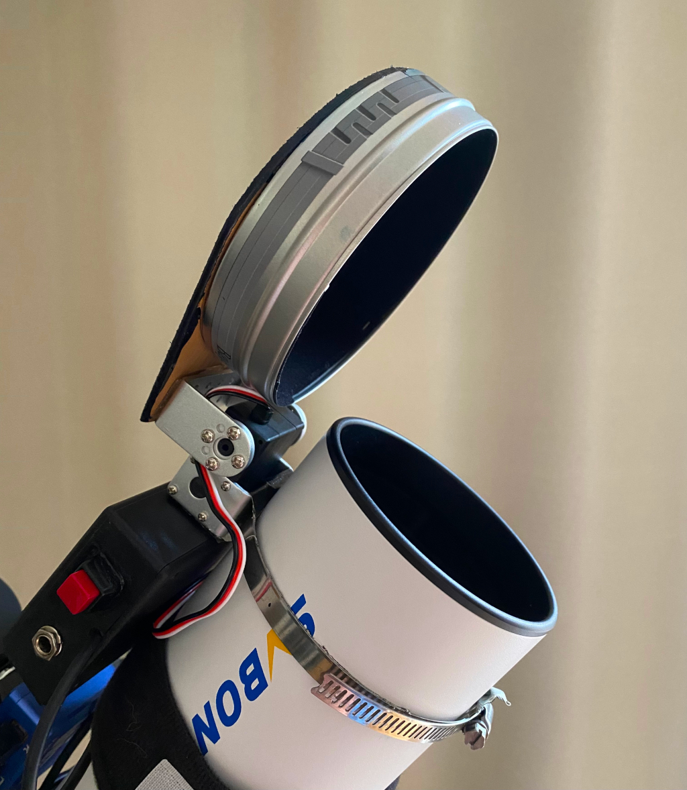
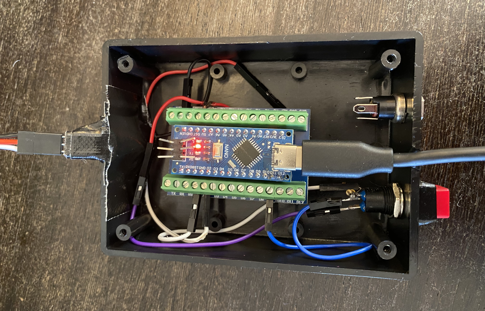
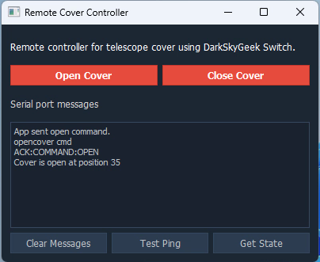
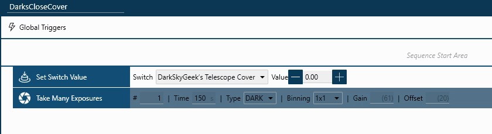
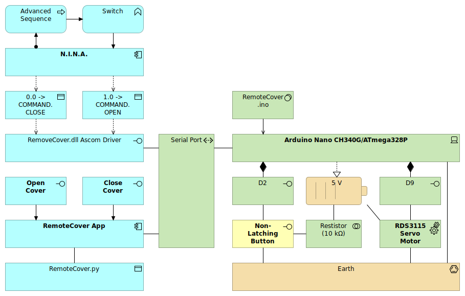

# ASCOM-Compatible Telescope Cover

## Introduction

This repository contains code that allows you to build an automated telescope cover that can be remotely controlled by astro imaging software. This enables you to capture Master Dark frames right after or in between imaging sessions using similar temperature conditions. 

[Demo video](https://youtube.com/shorts/TBGS7q0xyxU) 




### Requirements

My specific **requirements**:

- My imaging software [**N.I.N.A.**](https://nighttime-imaging.eu/)  can open and close the cover so I can take Master Dark frames after an imaging session
- A separate app for testing and manual imaging sessions van also open and close the cover remotely and detect it's state 
- A physical button on the cover can be used to open and close the cover when I'm at the telescope 

This repo is based on the work of **DarkSkyGeek**:

- [cloudynights.com/topic/819408-ascom-compatible-automated-telescope-dust-cover/](https://www.cloudynights.com/topic/819408-ascom-compatible-automated-telescope-dust-cover/).
- [github.com/jlecomte/automated-telescope-dust-cover](https://github.com/jlecomte/automated-telescope-dust-cover)

In this repository, you will find a copy of DarkSkyGeek repo:

- The code for the ASCOM driver (Microsoft Visual Studio 2022 project) with a release file
- The various STL files to 3D print all the mechanical parts, which I did not use as I have a different size telescope and have no experience with 3D printing, yet

to which I have added:

- Adjusted code for **Arduino Nano** firmware
- Python code for a **remote app** with a Windows executable release file
- An alternative electronic circuit for adding a **manual control button** and using specific electronic hardware

***I did not include a design or specifications for an actual cover nor an electronics compartment nor a attachment mechanism, I leave that to your creativity.***

## Design

Hardware used in this project:

- **RDS3115 servo** kit to move the cover (manufacturer: [dsservo.com](https://www.dsservo.com/show_imgnews.asp?id=417)) 
- **Arduino Nano** v3 controller CH340G/ATmega328P to control and power the servo kit
- An USB cable to connect the Arduino to the PC
- A non-latching button with a resistor to send a manual trigger command to the Arduino

## Build instruction 

1. Connect the **Electronics**
1. Update the **firmware** code in the remote_cover_ascom.ino file with the correct **configuration** as described in this section
1. **Flash** the firmware to the Arduino
1. **Test** using the non-latching button and adjust the configuration until the open and closed position are correct
1. Connect the Arduino to the **PC** and check the USB Coms port settings
1. Install the **App** and repeat the test
*1. Connect the actual cover to the servo motor and install it on the telescope*
1. Install the **ASCOM** driver
1. Open **N.I.N.A.** and connect the remote cover via the **Equipment** section as a **Switch**

### Electronics

The servo has to be connected to the Arduino board as follows: 

- Red cable: +5V ()
- Black cableGround ()
- White cable: One of the signal pins of the Arduino board (in the current code to pin D2) 

The non-latching button has to be connected to the Arduino board as follows:

- From the Arduino **5V** connector to the **button input** connector
- From a **signal pin** of the Arduino board (in the current code pin D9) to a **button output** connector
- In parallel, from the **button output** connector to a **resistor** (10 kOhm)
- From the **resistor** to an Arduino **Ground** connector

*The push button connection is taken from this project: *[instructables.com/How-to-use-a-Push-Button-Arduino-Tutorial/](https://www.instructables.com/How-to-use-a-Push-Button-Arduino-Tutorial/) 



### Arduino firmware configuration

*Reference for editing and flashing the Arduino: *[arduino.cc/en/software](https://www.arduino.cc/en/software)

The Arduino pin connections to the button and the servo must be set in the firmware code:

- line 34: `Switch = 9`: input pin for the non-latching button, in this example pin 9
- line 46: `servo.attach(2)`: output pin for the servo, in this example pin 2

The Arduino communicates via a serial port that is configured and activated in the firmware code. 
The serial port and baud rate settings must align with the settings of the USB port in the Windows PC:

- line39: `Serial.begin(57600)`: 

The servo is switching between an open angle and a closed angle, both to be configured in the firmware code.
Suggest to configure and test this before final assembly:

- line 30: `angle_closed = 103`: This is the default position of the cover wil go to when the Arduino is powered on
- line 31: `angle_open = 35`: Currently set to a 90 degrees angle relative to the closed position

### The App

Download the App from the [Releases section.](https://github.com/jlecomte/ascom-telescope-cover/releases).
Use the App to test the remote operation of the cover. The display area show the messages send and received and the state of the cover. The Test Ping button can be used to test the handshake between the Arduino and the ASCOM driver.



### ASCOM Driver

**Step 1:** Download the driver from the [releases page](https://github.com/jlecomte/ascom-telescope-cover/releases), and place the file `ASCOM.DarkSkyGeek.TelescopeCover.dll` somewhere on your system (example: `C:\Users\julien\ascom-telescope-cover\`).

**Step 2:** Open a command prompt, but make sure you run it **as an administrator**!

**Step 3:** Then, proceed with the installation of the driver using `RegAsm.exe`, a utility that should already be present on your system (it comes with the .NET framework). Just don't forget to use the 64 bit version, and to pass the `/tlb /codebase` flags. Here is what it looked like on my imaging mini computer:

```
> cd C:\Users\julien\ascom-telescope-cover\
> C:\Windows\Microsoft.NET\Framework64\v4.0.30319\RegAsm.exe /tlb /codebase ASCOM.DarkSkyGeek.TelescopeCover.dll
Microsoft .NET Framework Assembly Registration Utility version 4.8.4161.0
for Microsoft .NET Framework version 4.8.4161.0
Copyright (C) Microsoft Corporation.  All rights reserved.

Types registered successfully
```

**Note:** The output may be more verbose than the above. As long as it says `Types registered successfully`, you are good to go!

**Note:** During registration, you will see a warning that the assembly is unsigned. This is normal as I did not bother going through the pain of signing the assembly, so you will just have to trust that you are registering the DLL that I built and uploaded to GitHub. And if you don't trust me / GitHub, you can build the DLL yourself using Visual Studio.

**Note:** Once the driver has been installed, make sure you do _not_ delete or move the `ASCOM.DarkSkyGeek.TelescopeCover.dll` file, or things will not work! (if you do move it, you will need to register it again in its new location)

**Step 4:** Start (or restart, if it was already running) N.I.N.A. (or whatever application you use to control your equipment).

### N.I.N.A.

When the ASCOM driver is correctly installed and the USB port is correctly configured, N.I.N.A. should automatically detect is as a **Switch** with the name *DarkSkyGeek's Telescope Cover*.


The Switch can be added to an advanced sequence in N.I.N.A. using the **Set Switch Value** trigger:

- 0 = Closed (default)
- 1 = Opened



## Application architecture overview




